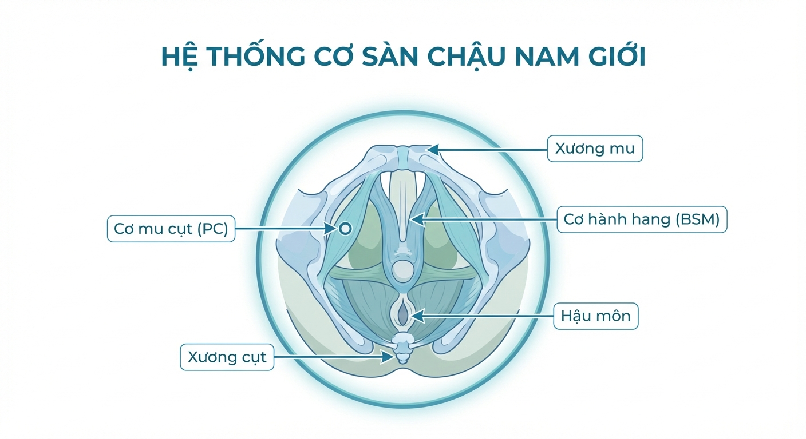
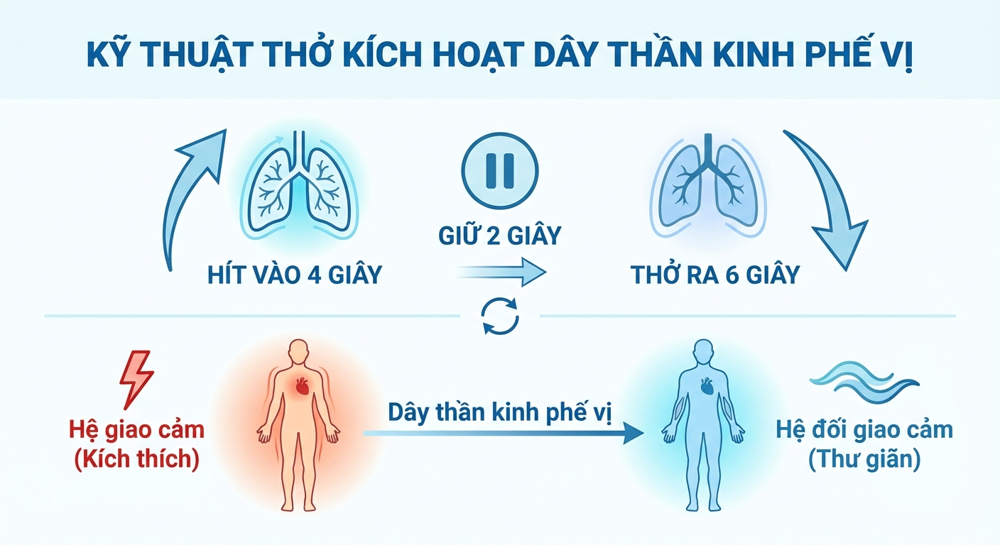
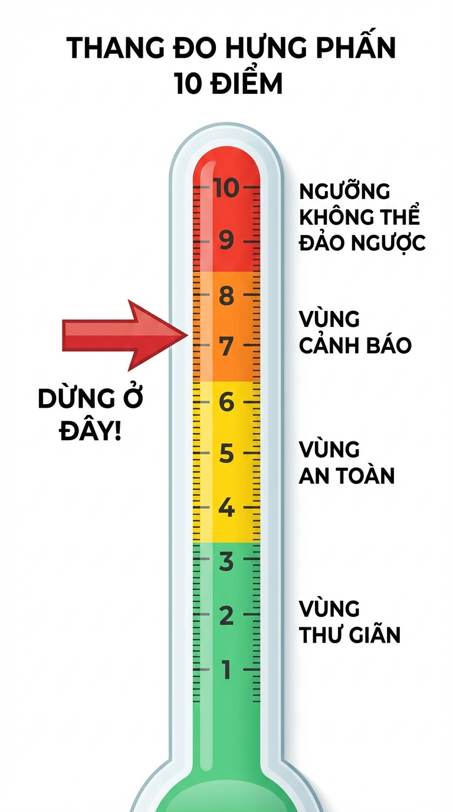
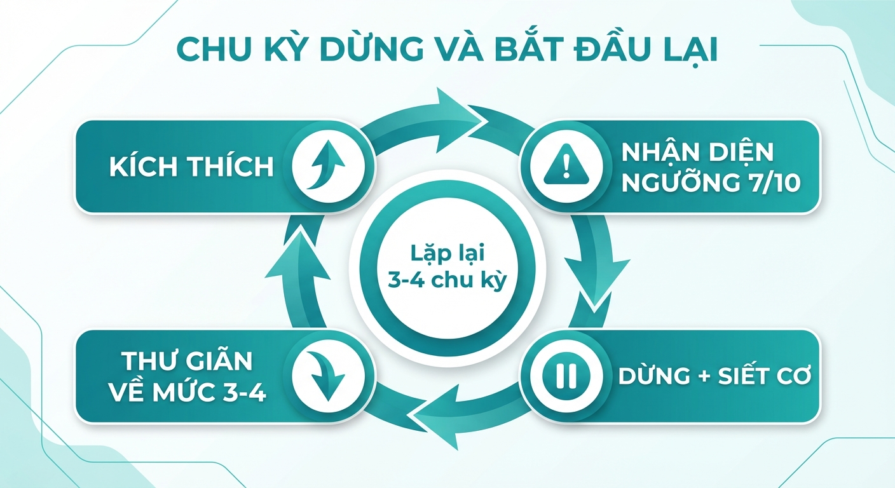
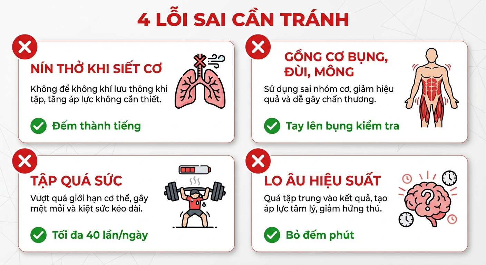
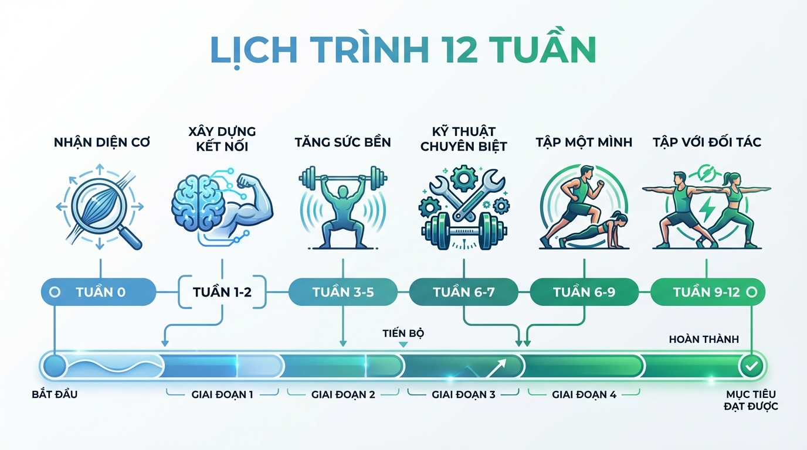

# Kiểm Soát Phản Xạ XT TẠI NHÀ

[Thiết Kế Khoá Học — Điều Trị XTS Tại Nhà](https://app.notion.com/p/Thi-t-K-Kho-H-c-i-u-Tr-XTS-T-i-Nh-2ba213b7926e4bcea144e25a3b9be7b8?pvs=21)

*Khóa học chuyển hoá kiến thức y khoa thành 6 bài học đơn giản, giúp nam giới làm chủ cơ thể và kiểm soát xuất tinh trong 12 tuần.*

---

## CƠ SỞ KHOA HỌC

Hệ thống cơ sàn chậu nam giới: cơ mu cụt (PC), cơ hành hang (BSM), xương mu, xương cụt, hậu môn

Thử nghiệm tại Đại học Sapienza (Rome, Ý) trên 40 nam giới mắc xuất tinh sớm mãn tính: sau 12 tuần tập cơ sàn chậu, thời gian từ lúc thâm nhập đến xuất tinh, gọi là IELT (tiếng Anh: Intravaginal Ejaculation Latency Time), trung bình tăng từ 31.7 giây lên 146 giây (gấp 4 lần). 82.5% đạt kiểm soát phản xạ xuất tinh. Thuật ngữ IELT được dùng xuyên suốt khóa học.

Các tổng quan hệ thống ghi nhận tỷ lệ cải thiện 55% đến 83%. Hiệp hội Tiết niệu Châu Âu xác nhận tập cơ sàn chậu là phương pháp điều trị đầu tay, không xâm lấn cho xuất tinh sớm.

<aside>
📋

6 bài học sắp xếp theo trình tự tiến dần trong 12 tuần. Hoàn thành đủ thời gian mỗi giai đoạn trước khi sang bài mới.

</aside>

---

## SÀNG LỌC BAN ĐẦU: AI NÊN VÀ KHÔNG NÊN TỰ TẬP

Xuất tinh sớm (tiếng Anh: Premature Ejaculation, viết tắt PE) không phải lúc nào cũng là vấn đề cơ sàn chậu đơn thuần. Thuật ngữ PE được dùng xuyên suốt khóa học.

<aside>
⛔

CẦN KHÁM BÁC SĨ TIẾT NIỆU HOẶC NAM KHOA TRƯỚC NẾU:

1. PE kèm đau vùng chậu, đau khi xuất tinh, tiểu rắt/buốt (gợi ý viêm tuyến tiền liệt)
2. PE kèm rối loạn cương (30% nam giới có PE đồng thời có rối loạn cương, Kegel mạnh có thể phản tác dụng nếu cơ sàn chậu đã quá căng)
3. PE xuất hiện đột ngột sau thời gian dài kiểm soát bình thường, kèm thay đổi tâm trạng/mệt mỏi/giảm ham muốn (gợi ý rối loạn nội tiết)
4. Đang dùng thuốc trầm cảm, lo âu, hoặc thuốc tác động lên thần kinh trung ương
5. PE kèm tê bì vùng sinh dục, tiền sử chấn thương cột sống/vùng chậu
</aside>

<aside>
✅

PHÙ HỢP TỰ TẬP NẾU:

1. PE đơn thuần, không kèm triệu chứng cảnh báo trên
2. Đã khám bác sĩ, xác nhận không có bệnh lý nền
3. Muốn cải thiện bằng phương pháp không dùng thuốc
4. Sẵn sàng tập đều đặn ít nhất 12 tuần
</aside>

### 3 DẠNG PE VÀ CÁCH TIẾP CẬN KHÁC NHAU

PE nguyên phát (lifelong): xuất hiện từ những lần quan hệ đầu tiên, xảy ra với mọi đối tác. Phổ biến nhất. Nghiên cứu Ösken (2025) trên 199 nam giới cho thấy nhóm này vẫn cải thiện IELT rõ rệt sau 8 tuần tập cơ sàn chậu (tiếng Anh: Pelvic Floor Muscle Training, viết tắt PFMT), nhưng chậm hơn PE mắc phải. Cần kiên nhẫn.

PE mắc phải (acquired): trước đây kiểm soát bình thường, PE xuất hiện sau stress, thay đổi đối tác, phẫu thuật, hoặc thay đổi thuốc. Đáp ứng nhanh hơn, nhưng cần loại trừ nguyên nhân y khoa trước.

PE tình huống (situational): chỉ xảy ra với đối tác mới, môi trường lạ, hoặc tư thế nhất định. Thành phần tâm lý chiếm ưu thế. Khóa học giúp phần cơ học, nhưng có thể cần hỗ trợ tâm lý bổ sung nếu không cải thiện sau 12 tuần.

---

## HƯỚNG DẪN CHO ĐỐI TÁC

<aside>
💬

Chia sẻ phần này với đối tác ngay từ tuần đầu tiên. Không cần đợi đến giai đoạn thực hành cùng nhau.

</aside>

PE là rối loạn chức năng tình dục phổ biến nhất ở nam giới (20% đến 30%). Không phải do thiếu quan tâm hay thiếu nỗ lực, mà do hệ thống kiểm soát phản xạ xuất tinh chưa được rèn luyện đầy đủ.

### CÁCH HỖ TRỢ

| Giai đoạn | Đối tác làm gì |
| --- | --- |
| Tuần 1 đến 8 (tự tập) | Hiểu rằng đối tác đang tập nghiêm túc. Không đặt áp lực về thời gian. Tránh bình luận so sánh. |
| Tuần 9 đến 12 (tập cùng) | Thỏa thuận ám hiệu dừng (vỗ nhẹ, nói "dừng"). Khi nhận ám hiệu, dừng mọi kích thích ngay. Hỗ trợ kỹ thuật ép (Bài 5). |
| Xuyên suốt | Giao tiếp cởi mở. Thành công đo bằng khả năng kiểm soát và sự hài lòng chung, không phải số phút. |

---

## BÀI 1: NHẬN DIỆN CƠ SÀN CHẬU

Vùng đáy chậu chứa hai nhóm cơ then chốt: cơ mu cụt (PC) và cơ hành hang (BSM). Khi hưng phấn đến ngưỡng, cơ hành hang co thắt theo phản xạ tự động để xuất tinh. Tập cơ sàn chậu giúp bạn xây dựng đường liên kết thần kinh để chủ động can thiệp vào chuỗi phản xạ này.

### 3 CÁCH TÌM ĐÚNG CƠ

1. Ngắt dòng tiểu: khi đang đi tiểu, nín lại giữa chừng. Khối cơ gồng lên bên trong khung chậu (không phải bụng/mông) chính là cơ sàn chậu.
2. Nín xì hơi: tưởng tượng đang ở nơi công cộng và nín xì hơi. Cơ siết quanh hậu môn là một phần cơ sàn chậu. An toàn hơn cách 1.
3. Xúc giác: nằm ngửa, đặt ngón tay lên vùng đáy chậu (giữa bìu và hậu môn). Siết cơ đúng sẽ thấy vùng này nhô lên và cứng lại.

<aside>
⚠️

Bài ngắt dòng tiểu chỉ thử tối đa 1 lần/tuần để nhận biết. Không biến thành bài tập thường xuyên vì gây rối loạn bài xuất và viêm bàng quang.

</aside>

### XÁC NHẬN ĐÚNG CƠ KHI:

- Dương vật hơi rút nhẹ vào trong khi siết
- Vùng đáy chậu nhô lên khi chạm tay kiểm tra
- Bụng, đùi, mông vẫn mềm, không gồng theo
- Thở bình thường trong lúc siết

Đạt cả 4 dấu hiệu → sẵn sàng sang Bài 2.

---

## BÀI 2: XÂY DỰNG KẾT NỐI (TUẦN 1 ĐẾN 2)

Mục tiêu: giúp não quen điều khiển cơ sàn chậu độc lập. Chưa tập mạnh, chỉ hình thành phản xạ mới.

### CÁCH TẬP

- Tư thế: nằm ngửa, đầu gối gập, bàn chân đặt phẳng (loại bỏ áp lực trọng lực lên vùng chậu)
- Hít vào chậm qua mũi 2 đến 3 giây
- Thở ra chậm, đồng thời siết cơ sàn chậu 50% đến 60% sức tối đa, giữ 3 đến 5 giây
- Thả lỏng hoàn toàn 3 đến 5 giây (bắt buộc nghỉ đủ thời gian)
- Lặp lại 8 đến 10 lần = 1 hiệp

### LỊCH TẬP

| Thời điểm | Số hiệp | Siết/hiệp | Giữ | Nghỉ |
| --- | --- | --- | --- | --- |
| Sáng | 1 | 8 đến 10 | 3 đến 5 giây | 3 đến 5 giây |
| Trưa | 1 | 8 đến 10 | 3 đến 5 giây | 3 đến 5 giây |
| Tối | 1 | 8 đến 10 | 3 đến 5 giây | 3 đến 5 giây |

Tổng: 24 đến 30 lần/ngày. Không quá 30 lần.

### SANG BÀI 3 KHI:

- [ ]  Siết cơ sàn chậu mà không gồng bụng/đùi/mông
- [ ]  Giữ ổn định 5 giây không run, không sụt lực
- [ ]  Phân biệt rõ trạng thái siết và thả lỏng
- [ ]  Siết theo ý muốn bất kỳ lúc nào

Chưa đạt cả 4 → kéo dài thêm 1 tuần.

### XỬ LÝ KHI GẶP KHÓ KHĂN BÀI 2

Không giữ được 5 giây sau 3 tuần: bạn đang siết quá mạnh. Giảm xuống 30% đến 40% sức, tập giữ ở lực nhẹ trước. Sau 4 tuần không tiến bộ → tham khảo chuyên gia vật lý trị liệu sàn chậu (có thể cơ đang co thắt mãn tính cần giải phóng trước).

Không thể siết mà không gồng bụng/mông: não chưa hình thành đường kết nối riêng đến cơ sàn chậu. Giảm lực xuống 20% đến 30%, tập trung vào cảm giác kéo nhẹ ở đáy chậu. Tập trước gương để quan sát.

Đau vùng chậu sau tập: dừng 3 đến 5 ngày. Quay lại giảm 50% số lần siết và lực siết. Đau tái phát khi tập nhẹ → khám bác sĩ.

---

## BÀI 3: TĂNG SỨC BỀN (TUẦN 3 ĐẾN 5)

Cơ sàn chậu cần sức bền hơn sức mạnh tối đa (bạn cần duy trì kiểm soát nhiều phút, không chỉ 1 đến 2 giây). Giai đoạn này tăng đồng thời: cường độ, thời gian giữ, và đa dạng tư thế.

### 3 TƯ THẾ VÀ LÝ DO

| Tư thế | Áp lực ổ bụng | Khi nào tập |
| --- | --- | --- |
| Nằm ngửa | Thấp nhất | Khởi động đầu buổi |
| Ngồi thẳng trên ghế | Trung bình | Buổi trưa |
| Đứng thẳng | Cao nhất (gần thực tế) | Buổi tối |

### CÁCH TẬP

- Siết 70% đến 80% sức tối đa
- Tuần 3: giữ 6 đến 8 giây → Tuần 4 đến 5: giữ 10 giây
- Nghỉ 10 giây sau mỗi lần siết
- 10 đến 15 lần/hiệp, 3 hiệp/ngày

Tổng: 30 đến 40 lần/ngày. Không quá 40 lần.

### SANG BÀI 4 KHI:

- [ ]  Giữ 10 giây ổn định ở cả 3 tư thế
- [ ]  Kiểm soát được cường độ theo ý muốn (nhẹ/vừa/mạnh)
- [ ]  Không gồng bụng/mông kể cả tư thế đứng

### XỬ LÝ KHI GẶP KHÓ KHĂN BÀI 3

Giữ 10 giây nằm nhưng chỉ 4 đến 5 giây đứng: bình thường. Tập ngồi nhiều hơn (2 hiệp ngồi, 1 hiệp đứng) cho đến khi giữ 8 giây ngồi, rồi tăng tỷ lệ đứng.

Plateau (giữ 7 đến 8 giây, không tăng thêm sau 2 tuần): 30% đến 40% người tập gặp. Hai cách phá: (1) giảm thời gian giữ xuống 5 giây, tăng lực 90% trong 1 tuần rồi quay lại, hoặc (2) thêm 5 lần siết nhanh 1 đến 2 giây cuối mỗi hiệp.

Mỏi cơ buổi tối: cơ sàn chậu tích lũy mệt qua ngày. Giảm buổi sáng/trưa xuống 8 lần, dành dung lượng cho tối. Chất lượng quan trọng hơn số lượng.

---

## BÀI 4: PHANH KHẨN CẤP VÀ THẢ LỎNG SÂU (TUẦN 6 TRỞ ĐI)

Kỹ thuật thở kích hoạt dây thần kinh phế vị: hít vào 4 giây, giữ 2 giây, thở ra 6 giây

Hai kỹ thuật phục vụ hai mục đích đối lập: phanh khẩn cấp (chặn phản xạ) và thả lỏng sâu (xả áp lực).

### PHANH KHẨN CẤP (SIẾT NHANH)

- Siết 100% sức lực trong 1 đến 2 giây rồi buông ngay (như bóp mạnh trái bóng rồi thả)
- Tập: thêm 10 lần siết nhanh cuối mỗi buổi tập
- Dùng khi: kích thích dâng lên đột ngột (vừa thâm nhập, đổi tư thế, đối tác thay đổi nhịp)
- Cú siết mạnh gửi tín hiệu ức chế lên tủy sống, chặn chuỗi phản xạ xuất tinh

<aside>
🔑

Hiệu quả nhất ở mức hưng phấn 7 đến 8/10. Quá 9/10 có thể đã muộn.

</aside>

### THẢ LỎNG SÂU (KEGEL NGƯỢC)

Nhiều nam giới có vùng sàn chậu luôn căng cứng mãn tính mà không nhận ra. Cơ đã căng sẵn thì chỉ cần kích thích nhẹ là vượt ngưỡng.

- Làm ngược Kegel: thay vì siết kéo lên, nới lỏng và giãn ra hướng xuống
- Mô phỏng cảm giác bắt đầu đi tiểu, nhẹ nhàng "mở cửa" sàn chậu
- Kiểm tra đúng: đặt tay lên đáy chậu, đúng sẽ thấy giãn ra và mềm đi. Bụng mềm, hậu môn hơi mở.
- Dùng khi: hưng phấn tăng dần đều, vùng chậu căng cứng từ đầu, hoặc sau cú phanh khẩn cấp cần hạ nhiệt tiếp

<aside>
⚠️

Tuyệt đối không rặn. Thả lỏng sâu là động tác nhẹ nhàng, có kiểm soát. Nếu cảm thấy như rặn đi cầu thì đang làm sai, nguy cơ thoát vị hoặc trĩ.

</aside>

### KHI NÀO DÙNG KỸ THUẬT NÀO

| Tình huống | Kỹ thuật | Lý do |
| --- | --- | --- |
| Kích thích dâng lên đột ngột | Phanh khẩn cấp | Chặn phản xạ tức thì |
| Hưng phấn tăng dần đều | Thả lỏng sâu | Xả áp lực tích tụ |
| Vùng chậu căng cứng từ đầu | Thả lỏng sâu trước khi bắt đầu | Hạ mức nền căng thẳng |
| Sau phanh khẩn cấp, cần hạ nhiệt | Thả lỏng sâu + thở chậm | Phục hồi sau chặn phản xạ |

### XỬ LÝ KHI GẶP KHÓ KHĂN BÀI 4

Không phân biệt Phanh khẩn cấp và Kegel thường: khác ở tốc độ và cường độ. So sánh trực tiếp: siết chậm 3 giây giữ (Kegel), sau đó siết nhanh nhất 1 giây rồi thả (Phanh). Xen kẽ 5 lần mỗi loại.

Không thể Thả lỏng sâu, chỉ "không làm gì" hoặc rặn: kỹ thuật khó nhất, nhiều người cần 2 đến 3 tuần. Bắt đầu trên bồn cầu: hít vào sâu bụng phồng, thở ra chậm để cơ tự giãn theo nhịp thở. Không đẩy, chỉ "cho phép" mở ra. Quen rồi mới chuyển tư thế ngồi/nằm.

Phanh khẩn cấp không kịp: bạn phản ứng quá muộn (đã quá 8/10). Tập phản ứng sớm hơn ở mức 6 đến 7/10.

---

## BÀI 5: KỸ THUẬT DỪNG VÀ BẮT ĐẦU LẠI

Tích hợp tất cả kỹ năng Bài 1 đến 4. Kỹ thuật Stop-Start (bác sĩ James Semans, 1956) là phương pháp hành vi lâu đời nhất trong điều trị PE. Kết hợp với tập cơ sàn chậu, hiệu quả tăng đáng kể.

### THANG ĐO HƯNG PHẤN 10 ĐIỂM

Thang đo hưng phấn 10 điểm: vùng thư giãn, vùng an toàn, vùng cảnh báo, ngưỡng không thể đảo ngược

| Mức | Cảm giác | Hành động |
| --- | --- | --- |
| 1 đến 3 | Thư giãn, chưa hưng phấn rõ | Tiếp tục |
| 4 đến 6 | Hưng phấn rõ, cương ổn định, vẫn kiểm soát thoải mái | Vùng an toàn, duy trì ở đây |
| 7 đến 8 | Khó kiểm soát, cảm giác "dồn" ở vùng sinh dục | Vùng cảnh báo, chuẩn bị dừng |
| 9 | "Sắp không kìm được" | Dừng ngay |
| 10 | Không thể đảo ngược | Quá muộn |

Mục tiêu: nhận diện ranh giới mức 7 đến 9, can thiệp kịp thời kéo về vùng 4 đến 6.

### LẬP BẢN ĐỒ HƯNG PHẤN (TRƯỚC KHI TẬP STOP-START)

Dành 3 đến 5 buổi chỉ để quan sát, không áp dụng kỹ thuật nào. Kích thích chậm bằng tay, chỉ lắng nghe cơ thể và tự hỏi "mình đang ở mức mấy?".

Ghi nhận dấu hiệu cơ thể cụ thể ở mỗi cột mốc:

- Mức 3: bắt đầu hưng phấn rõ (cương ổn định)
- Mức 5: cảm giác dễ chịu lan rộng, hoàn toàn thoải mái
- Mức 7: "khó dừng lại", nhịp thở thay đổi
- Mức 9: "sắp không kiểm soát được"

Ghi lại: nhịp thở ra sao, cơ vùng nào căng, nhiệt độ thay đổi thế nào. Mỗi người có bản đồ riêng.

### GIAI ĐOẠN 1: TẬP MỘT MÌNH (TUẦN 1 ĐẾN 4)

Chu kỳ dừng và bắt đầu lại: kích thích, nhận diện ngưỡng 7/10, dừng + siết cơ, thư giãn về mức 3-4

1. Kích thích chậm bằng tay, chấm điểm hưng phấn liên tục
2. Chạm 7 đến 8/10 → dừng hoàn toàn, bỏ tay ra
3. Siết cơ sàn chậu thật mạnh, giữ 5 đến 10 giây (chặn tinh dịch vào niệu đạo)
4. Thả siết → thả lỏng sâu + thở: hít vào 4 giây, giữ 2 giây, thở ra 6 giây (thở ra dài kích thích dây thần kinh phế vị, chuyển cơ thể từ giao cảm sang đối giao cảm)
5. Chờ hưng phấn giảm về 3 đến 4/10 (30 giây đến vài phút)
6. Bắt đầu lại. Lặp 3 đến 4 chu kỳ trước khi xuất tinh.

<aside>
📊

Ghi lại sau mỗi lần tập: (1) tổng thời gian từ bắt đầu đến xuất tinh, (2) số chu kỳ dừng thành công. Cả hai sẽ tăng dần.

</aside>

### GIAI ĐOẠN 2: TẬP VỚI ĐỐI TÁC (TUẦN 5 ĐẾN 8)

Tập với đối tác phức tạp hơn vì thêm kích thích đa giác quan và áp lực tâm lý. Tiến hành từng bước:

1. Thỏa thuận ám hiệu dừng trước khi bắt đầu
2. Kỹ thuật ép hỗ trợ (đối tác thực hiện tại thời điểm dừng):
    - Ép quy đầu (Masters & Johnson): kẹp ngón cái và ngón trỏ dưới quy đầu, giữ 10 đến 20 giây
    - Ép gốc dương vật (basilar squeeze): ép tại gốc, dễ hơn vì không cần rút ra
    - Thử cả hai, chọn cách phù hợp nhất
3. Thâm nhập có kiểm soát:
    - Nhịp đầu tiên: siết Phanh khẩn cấp ngay (chặn cú sốc kích thích ban đầu)
    - Sau đó: duy trì Thả lỏng sâu theo nhịp
    - Hưng phấn quá 7/10: ra ám hiệu dừng, siết mạnh rồi thả lỏng + thở chậm

<aside>
💡

Tuần đầu với đối tác: mục tiêu là 2 đến 3 chu kỳ dừng thành công, không phải "kéo dài bao lâu".

</aside>

### XỬ LÝ KHI GẶP KHÓ KHĂN BÀI 5

Kỹ thuật tốt khi tự tập nhưng thất bại với đối tác: rất phổ biến. Nguyên nhân: thêm kênh giác quan + áp lực tâm lý. Giải pháp: quay lại giai đoạn trung gian. Đối tác kích thích bằng tay trước (bạn áp dụng kỹ thuật dừng). Thành thạo mức này mới sang thâm nhập. Đọc kỹ phần Nhận thức sai lệch (Bài 6).

Đối tác không kiên nhẫn: tập trung giai đoạn tự tập cho vững. Chia sẻ phần Hướng dẫn cho đối tác. Nhiều người thay đổi thái độ khi hiểu PE là vấn đề y khoa có giải pháp.

Sau 12 tuần không cải thiện: cân nhắc kết hợp thuốc (cần bác sĩ kê đơn):

- Dapoxetine: dùng theo nhu cầu trước quan hệ 1 đến 3 giờ
- Thuốc ức chế tái hấp thu serotonin chọn lọc (tiếng Anh: Selective Serotonin Reuptake Inhibitors, viết tắt SSRIs) liều thấp hàng ngày: paroxetine, sertraline
- Kem gây tê tại chỗ: lidocaine, prilocaine (dùng tạm thời)

Kết hợp thuốc + liệu pháp hành vi cho kết quả tốt hơn thuốc đơn thuần. Tiếp tục tập cơ sàn chậu song song.

---

## BÀI 6: 4 LỖI SAI CẦN TRÁNH VÀ YẾU TỐ TÂM LÝ

4 lỗi sai cần tránh: nín thở khi siết cơ, gồng cơ bụng đùi mông, tập quá sức, lo âu hiệu suất

### LỖI 1: NÍN THỞ KHI SIẾT CƠ

- Vấn đề: nín thở tạo hiệu ứng Valsalva, ép nội tạng xuống, biến nâng cơ thành rặn. Tập ngược hoàn toàn.
- Cách sửa: đếm thành tiếng "một, hai, ba, bốn, năm" lúc siết. Đếm được = đường thở mở.

### LỖI 2: GỒNG CƠ BỤNG, ĐÙI, MÔNG

- Vấn đề: não "ăn gian" bằng cơ phụ, không rèn đúng cơ sàn chậu. Thực tế sẽ không kiểm soát được.
- Cách sửa: tay đặt lên bụng dưới suốt bài tập. Bụng gồng = giảm lực siết. Ngồi ghế cứng, mông nhấc lên = đang gồng sai.

### LỖI 3: TẬP QUÁ SỨC

- Vấn đề: cơ sàn chậu nhỏ, chịu tải giới hạn. Hàng trăm lần/ngày gây co thắt mãn tính, vùng chậu nhạy cảm hơn → PE tệ hơn.
- Giới hạn: 30 đến 40 lần/ngày (cả siết dài và nhanh). Đau/mỏi → giảm 20 lần, nghỉ 1 đến 2 ngày/tuần.

### LỖI 4: LO ÂU HIỆU SUẤT

- Vấn đề: tự hỏi "sắp ra chưa?" kích hoạt giao cảm, adrenaline, co thắt cơ chậu → xuất nhanh hơn. Vòng lặp tiêu cực: càng lo càng sớm.
- Cách sửa: bỏ đếm phút, không đặt mục tiêu thời gian. Chuyển chú ý sang cảm giác toàn thân (da, cổ, lưng, chân) thay vì chỉ vùng sinh dục.

### NHẬN THỨC SAI LỆCH PHỔ BIẾN

| Niềm tin sai | Sự thật |
| --- | --- |
| "Đàn ông phải kéo dài 15 đến 20 phút" | IELT trung bình 5.4 phút (Waldinger, 2005, 500 cặp đôi đa quốc gia) |
| "Xuất sớm = kém cỏi" | PE là rối loạn chức năng sinh lý, 20% đến 30% nam giới gặp ở các mức độ |
| "Đối tác sẽ bỏ mình" | Sự hài lòng phụ thuộc giao tiếp, gắn kết cảm xúc và đa dạng hình thức âu yếm hơn thời gian thâm nhập |
| "Phải kiểm soát 100% từ lần đầu" | Kỹ năng cần 8 đến 12 tuần, thất bại tạm thời là bình thường. Không ai lái xe giỏi từ lần đầu. |

Khi nhận ra đang rơi vào niềm tin sai, tự nhắc: "Mình đang phản ứng với niềm tin, không phải thực tế."

### KỸ THUẬT TẬP TRUNG CẢM GIÁC (SENSATE FOCUS)

Kỹ thuật của Masters & Johnson (1960), nền tảng liệu pháp tình dục hiện đại. Tách hoạt động tình dục khỏi áp lực hiệu suất.

| Giai đoạn | Tuần | Nội dung | Quy tắc |
| --- | --- | --- | --- |
| 1 | 1 đến 2 | Chạm không sinh dục (đầu, cổ, vai, lưng, tay, chân) | Tuyệt đối không chạm vùng ngực và sinh dục. Chỉ quan sát cảm giác. |
| 2 | 3 đến 4 | Mở rộng bao gồm ngực và vùng sinh dục | Quan sát cảm giác, không hướng tới cực khoái. Hưng phấn cao → quay về vùng không sinh dục. |
| 3 | 5+ | Kết hợp kỹ thuật Dừng và Bắt đầu lại từ Bài 5 | Áp dụng toàn bộ kỹ năng đã học. |

Đặc biệt hữu ích cho PE tình huống và lo âu hiệu suất cao.

---

## LỊCH TRÌNH TỔNG THỂ 12 TUẦN

Lịch trình 12 tuần: từ nhận diện cơ đến tập với đối tác

| Tuần | Bài | Trọng tâm | Mục tiêu |
| --- | --- | --- | --- |
| 0 | 1 | Nhận diện cơ sàn chậu | Đạt 4 dấu hiệu xác nhận |
| 1 đến 2 | 2 | Xây dựng kết nối thần kinh | Siết độc lập, giữ 5 giây, 30 lần/ngày |
| 3 đến 5 | 3 | Tăng sức bền | Giữ 10 giây ở 3 tư thế, 40 lần/ngày |
| 6 đến 7 | 4 | Phanh khẩn cấp + Thả lỏng sâu | Thành thạo cả hai kỹ thuật |
| 6 đến 9 | 5.1 | Stop-Start tập một mình | 3 đến 4 chu kỳ dừng thành công |
| 9 đến 12 | 5.2 | Stop-Start với đối tác | Kiểm soát ổn định trong thực tế |
| Liên tục | 6 | Sửa lỗi + yếu tố tâm lý | Rà soát 4 lỗi mỗi tuần |

---

## SAU 12 TUẦN: DUY TRÌ

1. 1 hiệp/ngày (10 đến 15 lần siết, cả dài và nhanh)
2. Mỗi tuần dành 5 phút tự đánh giá: có mắc lại 4 lỗi không?
3. Nghỉ quá 2 tuần → quay lại Bài 3 tập 1 đến 2 tuần để phục hồi

<aside>
📋

Nghiên cứu Sapienza: nhóm duy trì tập đến tháng 6 vẫn giữ kết quả ổn định. Duy trì tập nhẹ = yếu tố quyết định lâu dài.

</aside>

---

## CÁC TRƯỜNG HỢP ĐẶC BIỆT

### PE KÈM RỐI LOẠN CƯƠNG (ED)

Khoảng 30% nam giới có PE đồng thời có rối loạn cương dương (tiếng Anh: Erectile Dysfunction, viết tắt ED).

Vấn đề: sợ mất cương → đẩy nhanh nhịp → kích thích đột ngột → xuất sớm. Nếu cơ sàn chậu đã quá căng, Kegel mạnh có thể làm tệ hơn.

Cách tiếp cận:

- Ưu tiên giải quyết ED trước (khám chuyên khoa)
- Tập 70% Thả lỏng sâu, 30% siết
- Đau/căng tăng sau tập → dừng, khám chuyên gia vật lý trị liệu sàn chậu

### PE TÌNH HUỐNG (SITUATIONAL PE)

Chỉ xảy ra với đối tác mới, môi trường lạ, tư thế nhất định. Tâm lý chiếm ưu thế.

Cách tiếp cận:

- Tập cơ sàn chậu vẫn có ích (công cụ vật lý để can thiệp)
- Trọng tâm: Sensate Focus (Bài 6) + xử lý nhận thức sai lệch
- 12 tuần không cải thiện → liệu pháp tâm lý với chuyên gia tình dục học

### KHI NÀO KẾT HỢP THUỐC

1. PE nguyên phát nặng, IELT dưới 1 phút dù tập đều 12 tuần
2. Lo âu hiệu suất nghiêm trọng, không thể tập với đối tác
3. Cần cải thiện nhanh trong khi chờ liệu pháp hành vi

Lựa chọn (tất cả cần bác sĩ kê đơn):

- Dapoxetine: dùng theo nhu cầu trước quan hệ 1 đến 3 giờ
- SSRIs liều thấp hàng ngày: paroxetine, sertraline
- Kem gây tê tại chỗ: lidocaine, prilocaine

Kết hợp thuốc + tập > thuốc đơn thuần. Tiếp tục tập song song.

---

## BẢNG THEO DÕI KẾT QUẢ

In ra hoặc sao chép vào sổ tay, ghi hàng tuần.

| Tuần | IELT (giây) | Chu kỳ dừng | Mức hưng phấn khi dừng | Tự tin (1 đến 10) | Ghi chú |
| --- | --- | --- | --- | --- | --- |
| 1 |  |  |  |  |  |
| 2 |  |  |  |  |  |
| 3 |  |  |  |  |  |
| 4 |  |  |  |  |  |
| 5 |  |  |  |  |  |
| 6 |  |  |  |  |  |
| 7 |  |  |  |  |  |
| 8 |  |  |  |  |  |
| 9 |  |  |  |  |  |
| 10 |  |  |  |  |  |
| 11 |  |  |  |  |  |
| 12 |  |  |  |  |  |

IELT: ước tính, không cần bấm giờ. Tự tin: cảm nhận chủ quan 1 đến 10. Đôi khi tự tin tăng trước IELT, đó là dấu hiệu tốt.

---

## TÀI LIỆU THAM KHẢO

### NGHIÊN CỨU LÂM SÀNG CHÍNH

1. Pastore AL, et al. (2014). Pelvic floor muscle rehabilitation for patients with lifelong premature ejaculation. Therapeutic Advances in Urology, 6(3), 83-88. IELT tăng từ 31.7 giây lên 146.2 giây sau 12 tuần. 82.5% đạt kiểm soát.

[Đọc toàn văn](https://pmc.ncbi.nlm.nih.gov/articles/PMC4003840/)

1. Özen A, Yıldız Ö (2023). Stop-start + sphincter control hiệu quả hơn stop-start đơn thuần. PLOS ONE.

[Đọc toàn văn](https://pmc.ncbi.nlm.nih.gov/articles/PMC10414676/)

1. Jiang M, et al. (2020). Kegel cải thiện IELT có ý nghĩa thống kê trên 37 nam giới. Andrologia, 52(2).

[Đọc toàn văn](https://onlinelibrary.wiley.com/doi/full/10.1111/and.13473)

1. Ösken A, et al. (2025). Cả PE nguyên phát và mắc phải đều cải thiện IELT sau 8 tuần PFMT trên 199 nam giới.

[Đọc toàn văn](https://pmc.ncbi.nlm.nih.gov/articles/PMC12516947/)

### TỔNG QUAN HỆ THỐNG

1. Myers C, Smith M (2019). PFMT hiệu quả cho cả rối loạn cương và PE. Tỷ lệ cải thiện 55% đến 83%. Physiotherapy, 105(2).

[Đọc trên PubMed](https://pubmed.ncbi.nlm.nih.gov/30979506/)

1. Khodamoradi K, et al. (2024). PFMT là lựa chọn không dùng thuốc hiệu quả, cải thiện bền vững. J Sexual Medicine, 21(Suppl 6).

[Đọc trên Oxford Academic](https://academic.oup.com/jsm/article/21/Supplement_6/qdae161.214/7916903)

1. Saitz TR, Serefoglu EC (2015). Tổng quan toàn diện về nguyên nhân và điều trị PE. Korean J Urology.

[Đọc toàn văn](https://pmc.ncbi.nlm.nih.gov/articles/PMC6915345/)

### HƯỚNG DẪN LÂM SÀNG

1. Hiệp hội Tiết niệu Châu Âu (EAU). Tập cơ sàn chậu là điều trị đầu tay cho PE mãn tính. Hội nghị lần 29, Stockholm, 2014.

[Đọc trên EAU](https://uroweb.org/news/lifelong-premature-ejaculation-can-be-treated-by-pelvic-floor-exercises)

1. Mayo Clinic. Hướng dẫn chẩn đoán và điều trị PE.

[Đọc trên Mayo Clinic](https://www.mayoclinic.org/diseases-conditions/premature-ejaculation/diagnosis-treatment/drc-20354905)

1. [InformedHealth.org](http://InformedHealth.org) (NCBI). Hướng dẫn tự chăm sóc PE.

[Đọc trên NCBI](https://www.ncbi.nlm.nih.gov/books/NBK547551/)

1. Healthy Male (Andrology Australia). Tỷ lệ cải thiện 55% đến 83%, khuyến cáo bài tập sàn chậu là bước đầu tiên.

[Đọc trên Healthy Male](https://www.healthymale.org.au/health-article/pelvic-floor-exercises-kegels-premature-ejaculation/)